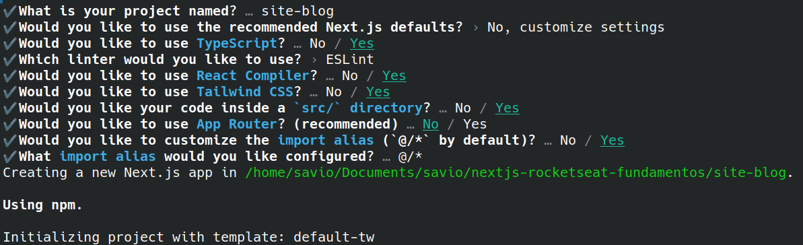

# nextjs-rocketseat-fundamentos

## maneiras de renderização Nextjs

### CSR (Cliente Side Render) [site carregado no lado do cliente]:

- vantagens:
  - paginas dinamicas
- desvantagens:
  - seo ruim (tempo load)
  - segurança (possibilidade de dados serem expostos na requisição)

### SSR (Server Side Render) [site carregado diretamente no servidor]:

- vantagens:
  - seo bom
  - segurança (usuário não tem acesso a requisição em seu navegador)
- desvantagens:
  - aumento da carga do servidor
  - sem api navegador (window e document)

### SSG (Static Side Generation) [site html é carregado em servidores no mundo estaticamente]:

- vantagens:
  - seo bom (páginas static com alta performance com cache em cdn)
- desvantagens:
  - não recomendado para site dinamico (para cada mudança um novo build demorado)
  - segurança (a mesma página será mostrada para todos os usuários da mesma forma)

### ISR (Incremental Static Regeneration) [html estatico mas sem rebuild do site inteiro para alterações, com determinado tempo a página pode ter dados atualizados]:

- vantagens:
  - seo bom
  - não gera páginas a cada requisição, reduzindo carga do servidor (vantagem sobre ssr e csr)
  - load rapido
- desvantagnes:
  - não é dinamico (possibilidade do usuário acessar página desatualizada

## navegação sem App Router (./src/pages):

- `_app.tsx`:
  - wrapper de todas as páginas
  - é executado tanto client quando server side
  - ideal para colocar providers (context api, theme provider, etc)
- `_document.tsx`:
  - executado apenas no server side
  - ideal para colocar tags html, head e body
  - ideal para colocar fontes externas e meta tags

## site-blog

- [link figma](https://www.figma.com/design/BnwDMZLJH0wWP7cTzDLDLx/Landing-Page-e-Blog--Community-?node-id=0-1&p=f&t=mh1tit8GHEB3bqr2-0)
- [docs shadcn](https://ui.shadcn.com/docs/components)

### config:

